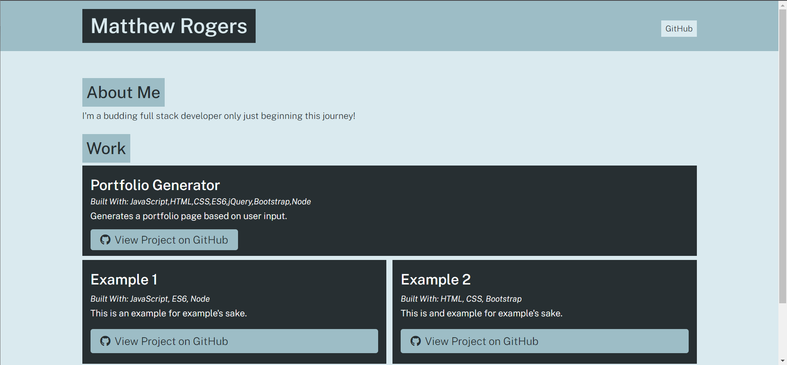

# Portfolio Generator

## Purpose
Node.js program to take user entered info and generate a portfolio page with said information.

## Built With
* HTML
* CSS 
* Javascript 
* Node.js

## Screenshot

## Installation
Clone repository from https://github.com/Vrentadax/portfolio-generator to your folder of choice.
Run 'npm install' to download relevent resources for the project.
Run 'node app' from the file root to start!

## Contribution
Made with ❤️ by Dax